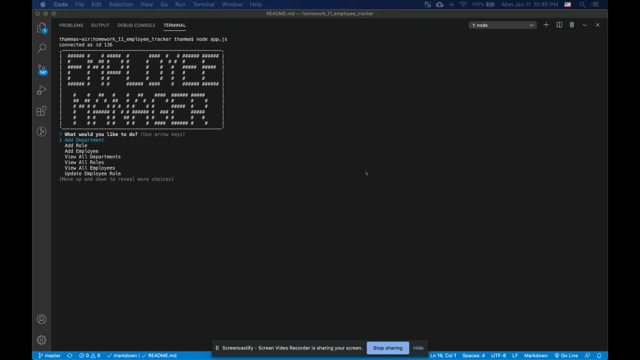

# Homework 11 - MySQL - Employee Tracker

## Objective
To architect and build a solution for managing a company's employees using node, inquirer, and MySQL. The interfaces should be easy for non-developers to view and interact with information stored in databases. Often these interfaces are known as **C**ontent **M**anagement **S**ystems.

## Acceptance Criteria
- Design the following database schema containing three tables: 
- Build a command-line application that at a minimum allows the user to:
  * Add departments, roles, employees
  * View departments, roles, employees
  * Update employee roles- All tests must pass.
- Bonus points if you're able to:
  * Update employee managers
  * View employees by manager
  * Delete departments, roles, and employees
  * View the total utilized budget of a department -- ie the combined salaries of all employees in that department

## Application

### Github Repository URL
https://github.com/thammaraku/homework_11_employee_trackers
### Application Screenshot

### Tutorial Video Link
https://drive.google.com/file/d/1qxNqydiStuOPSKAvcExYGyTlE93gTM6T/view?usp=sharing

## Knowledge learned from this assignment
1. Using MySQL to architect and manage database
2. Using Inquirer to interact with the user
3. Using different types of MySQL Query to manage database using JOIN / INSERT / DELETE
4. Learn how to use MySQL Workbench
5. Learn how to use console.table to display data in table format